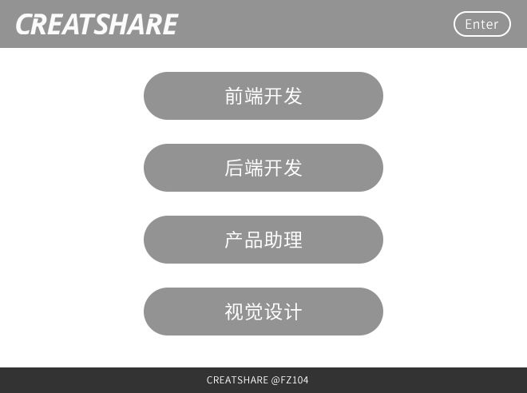

# 技术类

* 加分：将笔试题答案提交到 github 上对下方仓库链接进行 Pull Request：
> https://github.com/creatshare-demos/CreatShare-5th-Anniversary.git

## 基础部分

1. C 标准定义的关键字都有哪些？分别有什么用？
2. 以下式子的值为多少？为什么？
```
int Anniversary = (2016, ((0x01 << (int)2.0) + sizeof(char)));
```
3. -0 和+0 在计算机里以什么形式存储？这样存储有必要吗？
4. struct 与 class 有什么区别？
5. 面向对象三大特性和五大原则分别是什么？对我们编程有什么启示？
6. 简述 OSI 七层模型和 TCP/IP 四层模型区别。并理解 HTTP 在其中的定位。
7. 在 x86 系统下，有以下程序的运行结果是什么？在这个过程中系统都发生了什么？

```
#include <stdio.h>
#define HELLO “CREATSHARE %d!”
#define CREATSHARE(x) (x)
int main() {
    printf(HELLO,CREATSHARE(2016));
    return 0;
}
```

8. 在 x86 系统下，以下程序的运行结果是什么？为什么？

```
#include <stdio.h>
int main() {
    int a[4]={1,2,3,4};
    int *ptr1=(int *)(&a+1);
    int *ptr2=(int *)((int)a+1);
    printf("%x,%x",ptr1[-1],*ptr2);
    return 0;
}
```

9. 编写一个函数，如果操作系统是大端模式返回0，小端模式返回1。
10. 编写一个函数，参数中给定正整数 n 和 m，将1到n的这n个整数按字典排序之后，返回其中的第 m 个数字。对于n=11，m=4，按字典序排列依次为1，10，11，2，3，4，5，6，7，8，9。因此第4个数字为2。

## 前端部分

1. 谈谈你对广义的 HTML5 的理解。
2. 谈谈你对盒子模型和弹性盒模型的理解。
3. 列出常见的 CSS 预处理器并说明其优点。
4. 谈谈你对前端组件化开发的理解。
5. 谈谈你对前端 MV* 设计模式的理解。
6. 列出 JavaScript 中有哪些异步方法并区别这些方法。
7. 详细说明 JavaScript 的事件系统并简述事件捕获与事件冒泡的区别和事件委托的概念。
8. 有下列 HTML 及 CSS 片段，

```
<ul id="list">
    <li class="item">C</li>
    <li class="item">R</li>
    <li class="item">E</li>
    <li class="item">A</li>
    <li class="item">T</li>
    <li class="item">S</li>
    <li class="item">H</li>
    <li class="item">A</li>
    <li class="item">R</li>
    <li class="item">E</li>
</ul>

#list{
    margin: 0;
    padding: 0;
    list-style-type: none;
}
```

在不使用 Javascript，不改变现有 HTML 及 CSS 的情况下，添加代码，实现下列效果：

- 奇数位 li 背景为黄色，字的颜色为蓝色，字号为18px
- 偶数位 li 使文字剧中，字母下显示下划线
- 第一个 li 整体透明度为0.5
- 第四个 li 在鼠标移到其上方时使其2D放大3倍，且其他 li 不受影响，放大及缩小过程中应用平滑过渡效果，过渡持续0.3s
- 第八个 li 显示右边框，边框宽度4px，样式为实线，绿色

9. 有下列 JavaScript 代码，判断其运行后 console.log() 所显示的值，并解释原因(均为非严格模式)

```
  <button id="s" onclick="console.log(this)"></button>
  <script>console.log(this)</script>
  <script>
  	function a(){
	    console.log(this);
 	}
	new a();
   </script>
  <script>
  	var a = {};
	  a.print = function(){
              console.log(this);
	  }
       a.print();
  </script>
  <script>
  	function a(name){
            this.name = name;
	}

  	a.prototype.print = function(){
    	    console.log(this.name);
  	}

  	var q = new a('foo');
  	var x = new a('bar’);

  	q.print();
  	x.print();
   </script>
   <script>
	function a(name){}

	a.prototype.print = function(){
	    ;(function(){
            	console.log(this);
	    })();
   	}

	var q = new a();
	q.print();
   </script>
```

如果最后一段代码的 this 不指向 a 的实例，如何让其指向 a 的实例？

10. 以下两道编程题二选一，全做加分。

10.1. 代码实现下图所示布局。



10.2. 搭建开发环境，本地环境用 Post 方法向后台发送如下数据。如果是以下内容则返回“Happy 5 Anniversary!”，否则返回“error”。
```
{
    name: “CreatShare”
    anniversary: 5,
    year: 2016
}
```

## 服务端部分

1. 列出常见的关系型数据库和非关系型数据库。
2. 谈谈你对数据库和数据仓库的理解。
3. 谈谈你对对象关系型映射(orm)的理解。
4. 区分进程和线程。
5. 请用一个例子表明全局对象的缺点。
6. 区分 Stringbuffer 与 Stringbuilder。
7. 谈谈你对 TCP 三次握手中 TIME_WAIT 和 CLOSE_WAIT 状态的理解。
8. 简述在 epoll 的水平触发下，当 socket  可写的时候，会不停的触发写事件的原因。
9. 简述打开TCP套接字有很大开销的原因。
10. 以下两道编程题二选一，全做加分。

10.1. 使用信号量实现有限缓冲区的生产者和消费者问题。

10.2. 搭建开发环境，本地环境用 Post 方法向后台发送 Json 数据。如果是以下内容则返回“Happy 5 Anniversary!”，否则返回“error”。

```
{
    name: “CreatShare”
    anniversary: 5,
    year: 2016
}
```

# 产品类

## 必答题

1. 介绍一件给你留下印象最深的互联网事件，并说明理由。

2. 介绍你近期掌握的一项技能，并说明你的学习过程。

3. 你了解的产品经理和产品运营是什么关系？有什么异同点？

4. 你认为畅校园微信公众号存在哪些问题？如果你是产品经理，该如何改进？

5. 你有哪些方法来采集用户对一款APP产品的意见？


## 限选题（运营必选1、2、3；产品必选4、5、6）

1. 怎样帮助你的舍友追到只见过一面的 妹子/汉子？

2. 准备放寒假了，期间所有产品将会暂停维护，请你代表实验室向所有用户写一封邮件。

3. 如何在3个月内成为一名直播平台的网红？

4. 向你 5 岁的妹妹介绍什么是 Pokemon Go。

5. 向舍友推荐一款你最喜欢的互联网产品（APP、硬件...），写下你的思路

6. CreatShare 实验室要推出新产品，请你给出设计方案，其中包括但不限于：用户分析、场景分析、需求分析、功能设计。