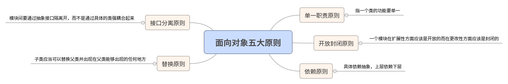

# 面向对象三大特性,五大原则

---

## 三大特性 ： 封装,继承,多态 
---
* 封装
 >封装就是把客观事物封装成抽象的类，并且类可以把自己的数据和方法只让可信的类或者对象操作，对不可信的进行信息隐藏。封装是面向对象的特征之一，是对象和类概念的主要特性。

* 继承
>继承是指可以让某个类型的对象获得另一个类型的对象的属性的方法。继承是指这样一种能力：它可以使用现有类的所有功能，并在无需重新编写原来的类的情况下对这些功能进行扩展。 
> 通过继承创建的新类称为“子类”或“派生类”，被继承的类称为“基类”、“父类”或“超类”。继承的过程，就是从一般到特殊的过程。
> 继承概念的实现方式有二类：实现继承与接口继承。实现继承是指直接使用基类的属性和方法而无需额外编码的能力；接口继承是指仅使用属性和方法的名称、但是子类必须提供实现的能力；

* 多态
>多态就是指一个类实例的相同方法在不同情形有不同表现形式。多态机制使具有不同内部结构的对象可以共享相同的外部接口。这意味着，虽然针对不同对象的具体操作不同，但通过一个公共的类，它们（那些操作）可以通过相同的方式予以调用。

## 五大原则
---
> * 单一职责原则SRP(Single Responsibility Principle)
> * 开放封闭原则OCP(Open－Close Principle) 
> * 替换原则(the Liskov Substitution Principle LSP) 
> * 依赖原则(the Dependency Inversion Principle DIP)
> * 接口分离原则(the Interface Segregation Principle ISP) 

