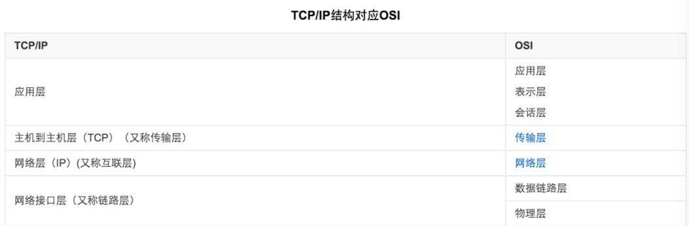

# OSI 七层模型和 TCP/IP 四层模型的区别 

---
- OSI 七层模型与 TCP/IP 四层模型的对比 -

 OSI 模型中没有清楚地描绘TCP/IP协议，但是在解释TCP/IP协议时很容易想到 OSI 模型。
 两者的主要区别如下： 
 
>* TCP/IP协议中的应用层处理 OSI 模型中的第五层、第六层和第七层的功能。 
> * TCP/IP协议中的传输层并不能总是保证在传 输层可靠地传输数据包，而 OSI 模型可以做到。TCP/IP协议还提供一项名为UDP（用户数据报协议）的选择。UDP不能保证可靠的数据包传输。

应用层应用层协议有很多，HTTP 协议便是其中一种。

* HTTP 协议的职责:
>规定客户端和服务器之间的数据传输格式
>生成针对 Web 服务器的 HTTP 请求报文
* HTTP 协议的特点:
 
 > 1. 支持客户/服务器模式
 > 2. 简单快速。客户向服务器请求服务时，只需传送请求方法和路径。由于HTTP协议简单，使得HTTP服务器的程序规模小，因而通信速度很快。
 > 3. 灵活。HTTP允许传输任意类型的数据，正在传输的类型由Content-Type加以标记。
 > 4. 无连接。限制每次链接只处理一个请求，服务器对客户端的请求做出响应后，马上断开链接，这种方式可以节省传输时间。
 > 5. 无状态。HTTP协议是无状态协议。无状态是指协议对于事务处理没有记忆能力。缺少状态意味着如果后续处理需要前面的信息，则它必须重传，这样可能导致每次连接传送的数据量增大。另一方面，在服务器不需要先前信息时它的应答就较快。
* HTTP 的工作机制:
 > 1. 客户端发起请求，与服务器端完成"TCP三次握手"
 > 2. 客户端向服务器端发出"HTTP请求报文" 
 > 3. 服务器端完成内部处理后，向客户端发出"HTTP响应报文"
 > 4. 客户端与服务器端完成"TCP四次分手"

