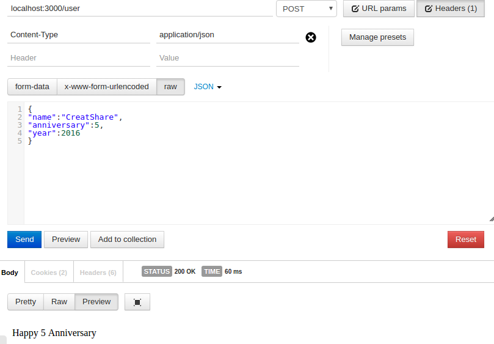

# 10.02 运行及结果

---
## 工具
---
 1. chrome 浏览器
 2. postman
## 如何运行
---
 1. clone 仓库至本地
 2. npm install 
 3. node app.js
 4. 在 chrome 浏览器中打开 postman ，输入如下信息：
 
 
 便可以看到运行结果了。
 ---
 参考资料：http://blog.csdn.net/sevenquan/article/details/50548713
 

