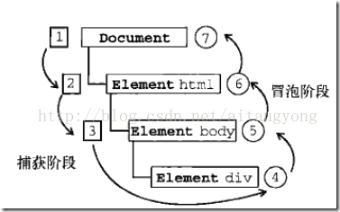

# JavaScript 事件系统


---

## 事件系统
---
JavaScript在浏览器中以单线程模式运行，页面加载后，一旦页面上所有的JavaScript代码被执行完后，就只能依赖触发事件来执行JavaScript代码。

浏览器在接收到用户的鼠标或键盘输入后，会自动在对应的DOM节点上触发相应的事件。如果该节点已经绑定了对应的JavaScript处理函数，该函数就会自动调用。

jQuery能够绑定的事件主要包括：

* 鼠标事件

> *  click: 鼠标单击时触发；
> * dblclick：鼠标双击时触发；
> * mouseenter：鼠标进入时触发；
> * mouseleave：鼠标移出时触发；
> * mousemove：鼠标在DOM内部移动时触发；
> * hover：鼠标进入和退出时触发两个函数，相当于mouseenter加上mouseleave。

* 键盘事件

键盘事件仅作用在当前焦点的DOM上，通常是```<input>```和```<textarea>```。

 > * keydown：键盘按下时触发；
 >* keyup：键盘松开时触发；
 >* keypress：按一次键后触发。

* 其他事件

> * focus：当DOM获得焦点时触发；
> * blur：当DOM失去焦点时触发；
> * change：当```<input>```、```<select>```或```<textarea>```的内容改变时触发；
> * submit：当```<form>```提交时触发；
> * ready：当页面被载入并且DOM树完成初始化后触发。

## 事件捕获、事件冒泡与事件委托
---


 **事件冒泡**：事件促发的最深层元素首先接收事件。然后是它的父元素，依次向上，直到document对象最终接收到事件。尽管相对于html元素来说，document没有独立的视觉表现，他仍然是html元素的父元素并且事件能冒泡到document元素。

 **事件捕获**：事件首先发生在DOM树的最高层对象(document)然后往最深层的元素传播。（注意IE6只有冒泡，没有捕获）。

 **事件委托**：我认为事件委托是利用冒泡原理，把事件的监听转换到其父元素上，也就是把事件绑定到父元素上，然后在事件中获取子元素对象，对其进行相应的操作。优点：1.提高性能2.减少代码量
