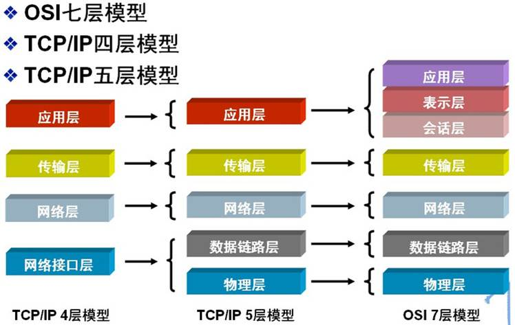
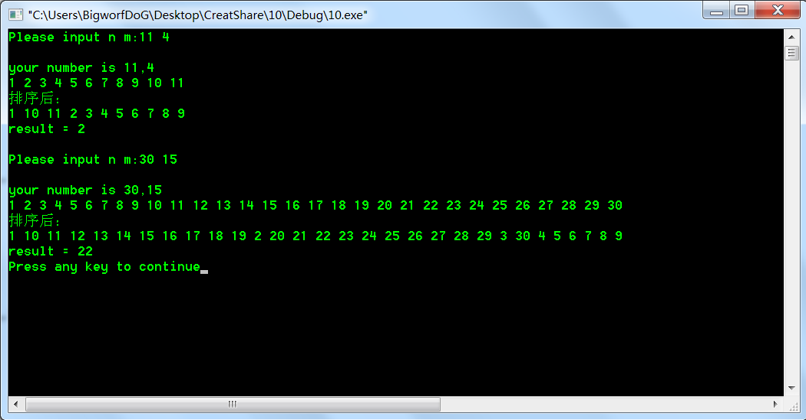
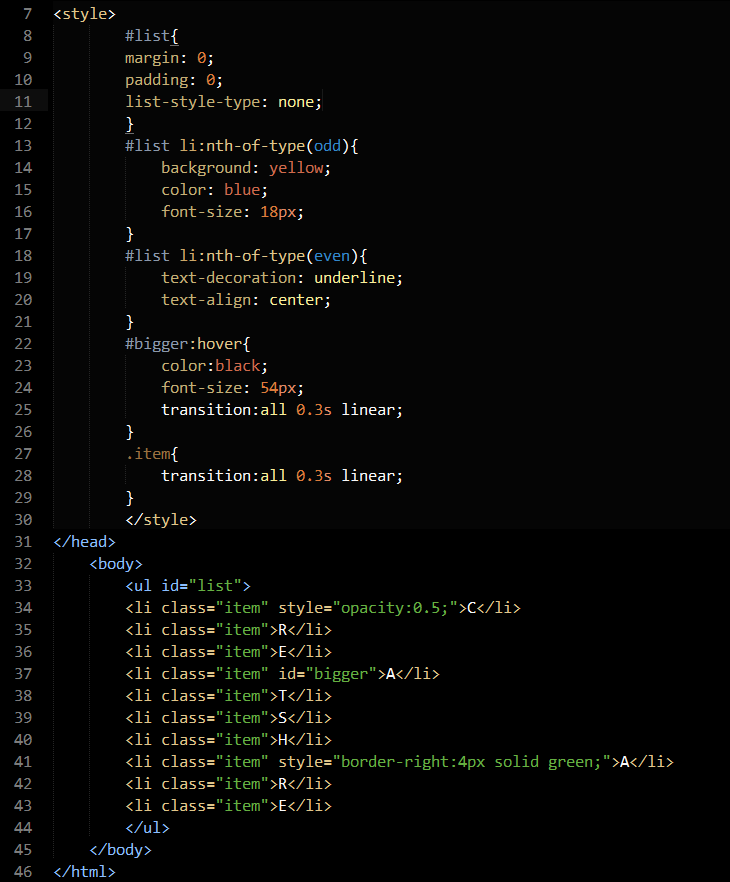
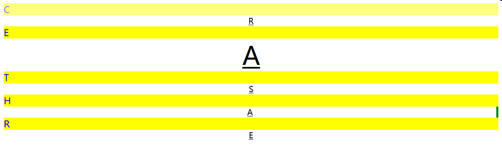
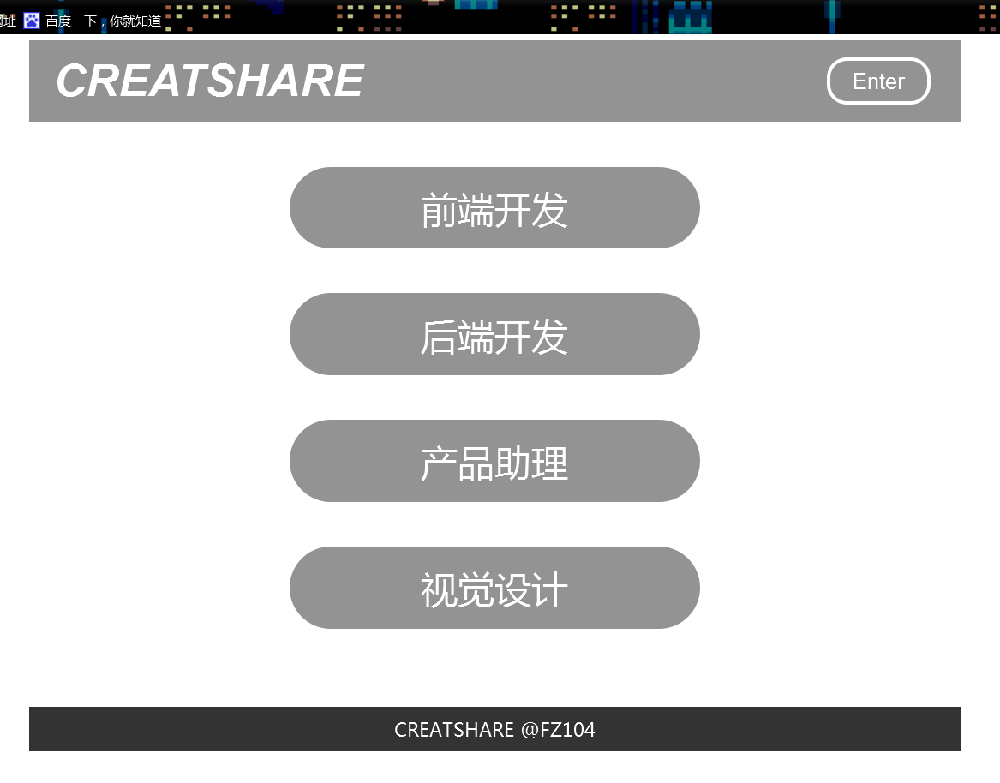
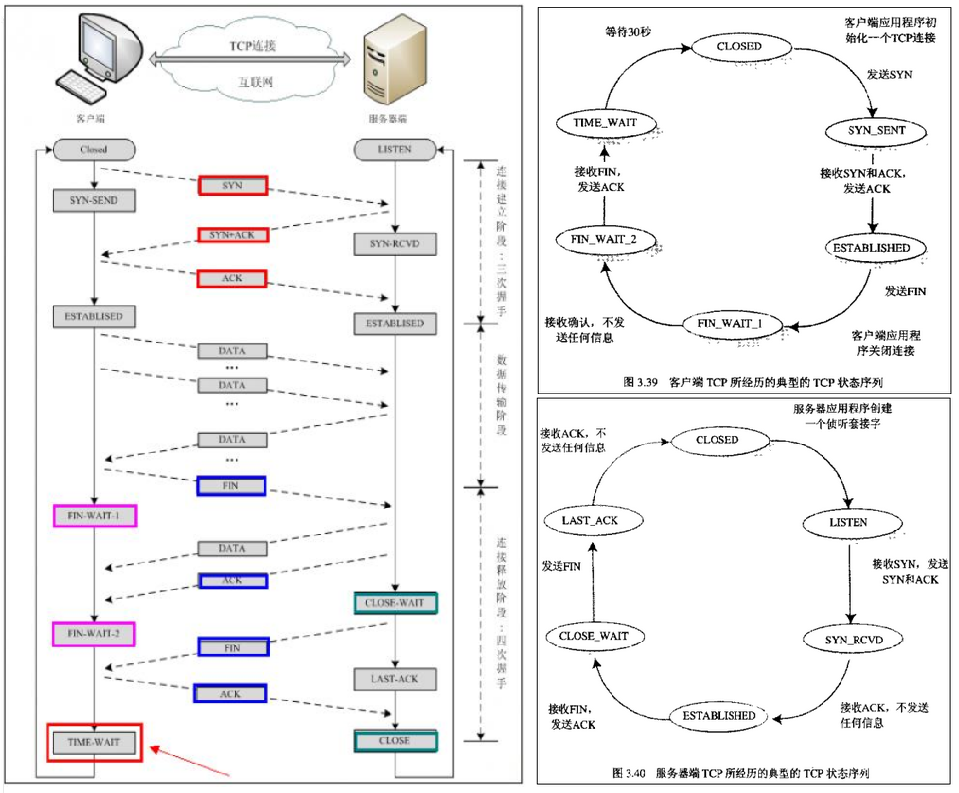

#基础部分：
1、32个关键字：
	struct		：声明结构体变量或函数
	enum 		：声明枚举类型
	union		：声明联合数据类型
	typedef		：用以给数据类型取别名（当然还有其他作用

	auto		：声明自动变量 一般不使用
	register	：声明积存器变量
	static 		：声明静态变量
	const 		：声明只读变量
	signed		：生命有符号类型变量或函数
	unsigned	：声明无符号类型变量或函数

	char 		：声明字符型变量或函数
	short 		：声明短整型变量或函数
	int			：声明整型变量或函数
	double		：声明双精度变量或函数
	long		：声明长整型变量或函数
	float		：声明浮点型变量或函数

	if			：条件语句
	else 		：条件语句否定分支（与if连用）

	do 			：循环语句的循环体
	while 		：循环语句的循环条件

	switch 		：用于开关语句
	case		：开关语句分支
	default		：开关语句中的“其他”分支

	for			：一种循环语句
	continue	：结束当前循环，开始下一轮循环
	break		：跳出当前循环
	goto		：无条件跳转语句

	void 		：声明函数无返回值或无参数，声明无类型指针（基本上就这三个作用）
	sizeof		：计算数据类型长度
	extern		：声明变量是在其他文件正声明（也可以看做是引用变量）
	return 		：子程序返回语句（可以带参数，也看不带参数）
	volatile	：说明变量在程序执行中可被隐含地改变
2、
，运算符：，前后均匀算，但只显示后表达式的值
0x十六进制  （int）强制数据类型转换	<< 左移运算符	sizoef运算符 
（2016，（0001<<2）+ 1）    = 4 + 1 =5  
  
3、
计算机中均以补码存在  

+0=0000 0000，-0=1000 000   故用-0表示 -（2^(n-1)）   -128 ~ 127  
  
4、
C++中的struct对C中的struct进行了扩充，
它已经不再只是一个包含不同数据类型的数据结构了，封装继承多态均可。
最本质的一个区别就是默认的访问控制：
struct作为数据结构的实现体，它默认的数据访问控制是public的，
而class作为对象的实现体，它默认的成员变量访问控制是private的。  

5、
封装,继承,多态  
单一职责原则（SRP）"对一个类而言，应该仅有一个引起它变化的原因。"  
开放封闭原则（OCP）"软件实体应该是可以扩展的，但是不可修改。  
里氏替换原则（LSP）"子类型必须能够替换掉它们的基类型。"  
依赖倒置原则（DIP）"抽象不应依赖于细节，细节应该依赖于抽象。"  
接口隔离原则（ISP）"多个专用接口优于一个单一的通用接口。"  
良性依赖原则。"不会在实际中造成危害的依赖关系，都是良性依赖。"通过分析不难发现，本原则的核心思想是"务实"，很好地揭示了极限编程(Extreme Programming)中"简单设计"各"重构"的理论基础。本原则可以帮助我们抵御"面向对象设计五大原则"以及设计模式的诱惑，以免陷入过度设计(Over-engineering)的尴尬境地，带来不必要的复杂性。  
><http://blog.csdn.net/cancan8538/article/details/8057095>  
  
6、    
  
HTTP在应用层
  
7、
两次宏替换 最终	CREARSHARE2016！  

8、	
**4.200**  

(int *)(&a+1)是移动一个指类，因为a是一个指向4个整形的指针，所以移动四个整形
并将现在所指向的内存当做整形来解释，ptr1[-1],向前移动一个指类（int）所以指向了
a[4]即4（十六进制输出无影响）  
(int *)((int)a+1)，a是该整形数组的指针，指向第一个元素的首地址，指向a[1]=1, +1向后移动一个字节，
x86中int只有两字节，小端存储方式，低位在地址值，高位在高地址  
a[4]= 01 00  02 00 03 00 04 00  ptr2从a[0]处向后移动一个字节  
00000001 00000000 (01 00)-> 00000000 00000010 (00 02) 即为 0200 故十六进制输出为200 
  
9、
  
	int BIG_or_little(){
		int i = 1;
		char *p = &i;
		short a,b;

		a = *p;
		b = *(p+1);
		if(a > b)		//根据低地址处的值来判断
			return 1;	//小端方式;
		else
			return 0;	//大端方式
	}	
10、  

	int dic_sort(int n, int m){
		int i,j,temp,count = 1;
		char temp1[8],temp2[8];					
		int *Array;

		Array =(int *)malloc(sizeof(int) * n);			//申请数组空间
		for(i=0;i<n;i++){
			Array[i] = count++;
			printf("%d ",Array[i]);
		}
		printf("\n排序后：\n");	
		for(i=0;i<n-1;i++)
			for(j=0;j<n-i-1;j++){						//冒泡排序
				sprintf(temp1,("%d"),Array[j]);			//转化为字符串
				sprintf(temp2,("%d"),Array[j+1]);
				if(1 == strcmp(temp1,temp2)){			//利用strcmp函数来比较
					temp = Array[j];
					Array[j] = Array[j+1];
					Array[j+1] = temp;
				}
			}
		for(i=0;i<n;i++)
			printf("%d ",Array[i]);

		return Array[m-1];
	}
 

#二、方向题
##前端：
###8、  
源代码：  
  
效果图：  

###10、  
左上角的字体没有找到...  
  
源代码在（./源代码及效果图）中。
##服务端：  
###1、  
当前主流的关系型数据库有Oracle、DB2、Microsoft SQL Server、Microsoft Access、MySQL等。  
非关系型数据库有 NoSql、Cloudant。
###2、
（1）数据库是面向事务的设计，数据仓库是面向主题设计的。

（2）数据库一般存储在线交易数据，数据仓库存储的一般是历史数据。 

（3）数据库设计是尽量避免冗余，数据仓库在设计是有意引入冗余。 

（4）数据库是为捕获数据而设计，数据仓库是为分析数据而设计  
   
就好比银行短期内的交易记录用数据库，短期数据量少，方便及时查询更改。  
而长期的各项数据，比如今年那个地区的存款总额是用数据仓库。用来分析便于做出正确决策。
###3、  
在面向对象的开发和关系型数据库的现状下，一种提高效率，减少工作量的方法。
###4、
线程是进程的子集，一个进程可以有一到多个线程，创建、销毁、切换简单，线程间资源共享，利用率高。而进程间编程调试简单，可靠性高，但是创建、销毁、切换复杂速度慢。  
###5、  
全局对象不利于程序后期的调试维护。比如程序出现异常，因为全局对象的作用范围是全局，所以导致调试的时候不易排错，必须跟踪整个程序。  
###6、  
1.  在执行速度方面的比较：StringBuilder >  StringBuffer   
2.  StringBuffer与StringBuilder，他们是字符串变量，是可改变的对象，每当我们用它们对字符串做操作时，实际上是在一个对象上操作的，不像String一样创建一些对象进行操作，所以速度就快了。
3.  StringBuilder：线程非安全的
　 	StringBuffer：线程安全的  
   当我们在字符串缓冲去被多个线程使用是，JVM不能保证StringBuilder的操作是安全的，虽然他的速度最快，但是可以保证StringBuffer是可以正确操作的。当然大多数情况下就是我们是在单线程下进行的操作，所以大多数情况下是建议用StringBuilder而不用StringBuffer的，就是速度的原因。
###7、
  
TIME\_WAIT:  表示收到了对方的FIN报文，并发送出了ACK报文，就等2MSL后即可回到CLOSED可用状态了。  
如果FIN\_WAIT\_1状态下，收到了对方同时带FIN标志和ACK标志的报文时，可以直接进入到TIME\_WAIT状态，而无须经过FIN\_WAIT\_2状态。    

CLOSE\_WAIT: 这种状态的含义其实是表示在等待关闭。怎么理解呢？当对方close一个SOCKET后发送FIN报文给自己，你系统毫无疑问地会回应一个ACK报文给对方，此时则进入到CLOSE_WAIT状态。接下来呢，实际上你真正需要考虑的事情是察看你是否还有数据发送给对方，如果没有的话，那么你也就可以close这个SOCKET，发送FIN报文给对方，也即关闭连接。所以你在CLOSE\_WAIT状态下，需要完成的事情是等待你去关闭连接。
###8、  
根据可以理解为，文件描述符的读写状态发生变化才会触发epoll事件，具体说来如下：二者的差异在于 level-trigger 模式下只要某个 socket 处于 readable/writable 状态，无论什么时候进行 epoll\_wait 都会返回该 socket；而 edge-trigger 模式下只有某个 socket 从 unreadable 变为 readable，或从unwritable 变为writable时，epoll\_wait 才会返回该 socket。
###9、  
建立套接字，绑定端口，监听套接字，链接。
###10.2  
###代码详见(./服务端10.2/CreatShare.php)  
没有实现json，只是用post提交数据在后台调用数据库查询判断返回。
效果图：  
  
  

